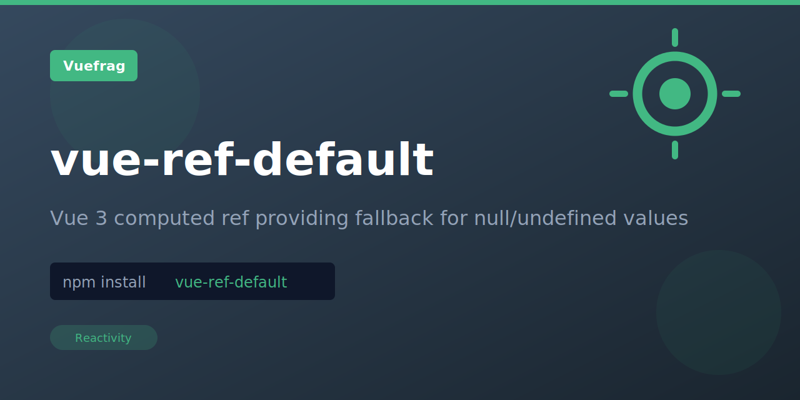

<p align="center">
  
</p>

<h1 align="center">vue-ref-default</h1>

<p align="center"></p>

<p align="center">
  <a href="https://www.npmjs.com/package/vue-ref-default"></a>
  <a href="https://www.npmjs.com/package/vue-ref-default"></a>
</p>

## Installation

```bash
npm install vue-ref-default
```

## Usage

Apply default value to a ref.

```ts
import { refDefault, useStorage } from 'vue-ref-default'

const raw = useStorage('key')
const state = refDefault(raw, 'default')

raw.value = 'hello'
console.log(state.value) // hello

raw.value = undefined
console.log(state.value) // default
```

## License

MIT

Extracted from [VueUse](https://vueuse.org/) for standalone use.
